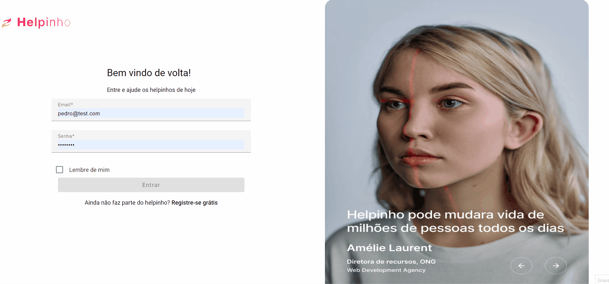
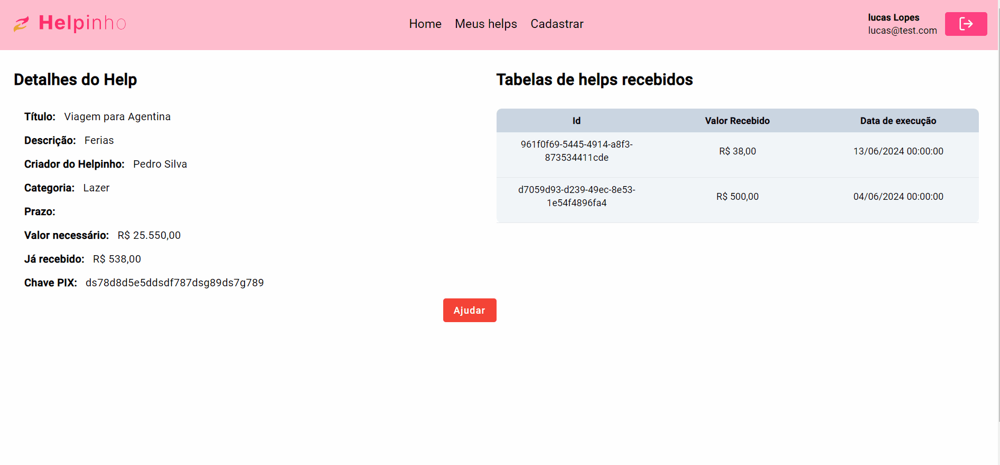
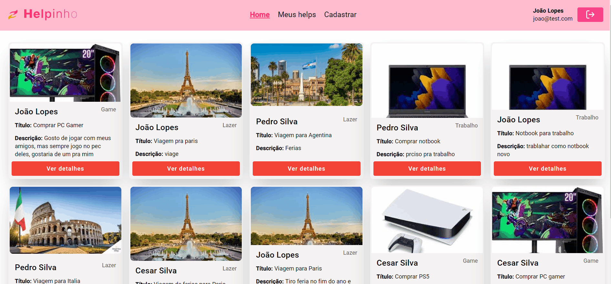
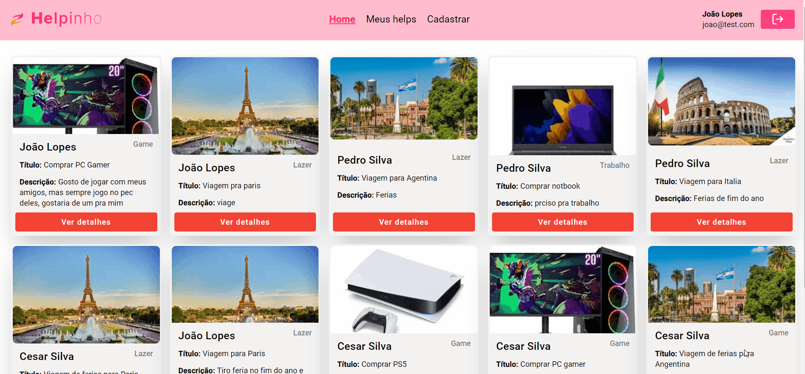

<br/><br/><br/>

# Helpinho

Este é um projeto de aplicativo web desenvolvido no frontend em **[Angular 17](https://v17.angular.io/docs)**, utilizando **Tailwind CSS** e **SCSS** para estilização e **Angular Material** para componentes de interface do usuário.

## :memo: Descrição

O objetivo deste aplicativo é permitir que pessoas possam se cadastrar, cadastrar helpinhos e da um help em outras pessoas. O aplicativo consome a API serveless detalhada **[aqui](../backend/README.md)**.

## :books: Funcionalidades

### Cadastro e login

- **Cadastro e login:** Os usuários podem se cadastrar e, logar no sistema.
  <br/><br/>
  
  <br/><br/>

### Listagem de helpinhos

- **Litagem:** lista os helpinhos de foma opaginada.
- **Ver detalhes:** permite ver detalhes de um helpinho.
  <br/><br/>
  
  <br/><br/>

### Realizar um Help

- **Dar um help:** permite aos usuário cadastre um help realizado a alguém.
  <br/><br/>
  
  <br/><br/>

### Listar helpinhos cadstrado por você

- **Listagem:** usuários podem listrar seus própios helpinhos.
- **Deletar:** usuários podem deletar seus própios helpinhos.
  <br/><br/>
  
  <br/><br/>

### Cadastro de helpinho

- **Cadastro:** o cadastro é feito em etapas obrigatórias.
- **Validações:** todos os campos tem validações devidas, com destaque no input de arquivo que valida tipo e tamanho do arquivo.
- **Pré-visualização:** na última etapa do cadastro há uma pré-visualização de como ficará o helpinho antes de ser cadastrado.
  <br/><br/>
  
  <br/><br/>

### Responsividade


<br/><br/><br/>

## Interface do Usuário

A interface do usuário foi desenvolvida com foco na usabilidade e experiência visual agradável.

## :wrench: Tecnologias utilizadas

✔ **[Angular](https://v17.angular.io/docs)**

✔ **[Tailwind CSS](https://tailwindcss.com/docs/guides/angular)**

✔ **[Angular Material](https://v17.material.angular.io/components/categories)**

## Arquitetura

O projeto foi desenvolvido na arquitetura standalone padrão recomendada pelo [Angular](https://v17.angular.io/docs). O gerenciamento de estado foi feito de forma reativa com o [RxJS](https://rxjs.dev/api) e [Signals](https://v17.angular.io/guide/signals). Também foi resposividade, fazendo com que o app possa ser utilizado em diverso tipos de dispositivos.

## Ambiente de Desenvolvimento

O projeto foi desenvolvido no seguinte ambiente:

- **Node.js 20**
- **Angular CLI 17**

## Como Executar o Projeto Localmente

> Para isso você precisa ter [Node, NPM](https://nodejs.org/en) e [Git](https://git-scm.com/) instalados.

1. Clone este repositório.

```sh
git clone https://github.com/Lucas-Lopes-II/LBCA-TI-Helpinho.git
```

2. Navegue até o diretório do projeto na pasta frontend.
3. Execute `npm install` para instalar as dependências.

```sh
npm install
```

4. Execute `npm start` para iniciar o servidor de desenvolvimento.

```sh
npm start
```

5. Seu navegador irá abrir uma janela com: `http://localhost:4200/` onde a aplicação já estará dispinível para uso.

> OBS: certifique-se que a api estará disponível e os enviroments estejam devidamente apontados pra ela.

## Contato

[Linked-in](https://www.linkedin.com/in/lucas-lopes-840965190/)

[Email](mailto:lucas.santos.pessoal@outlook.com)
